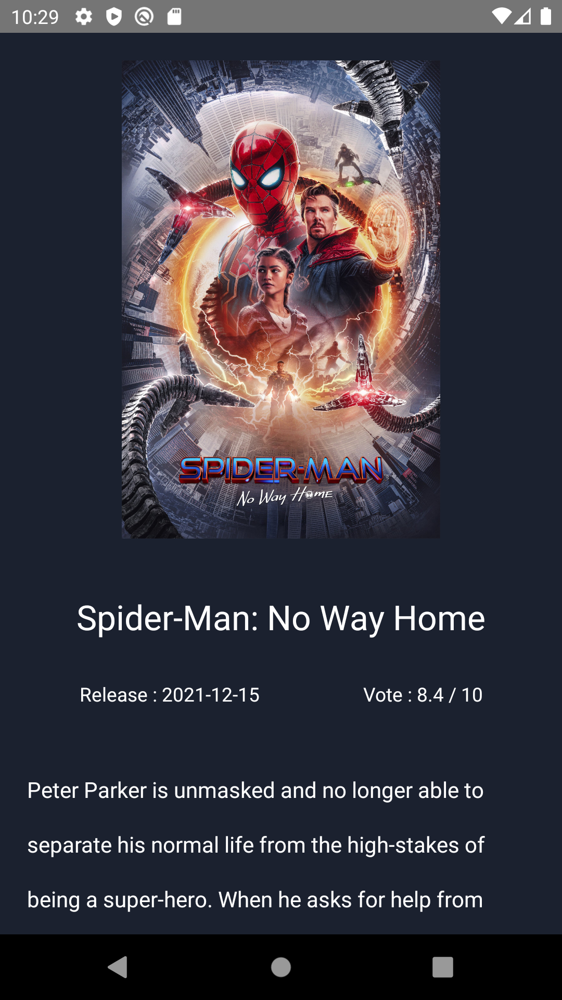

# Movie App 🚀

React Native Movie App

* Fetch Trending Movies
* Fetch Movies According to Genre
* Movie Detail Screen


# Screenshots 📷

# Home Screen 

<p align='center'>
    
</p>

<br />
<br />

# Home Screen 2

<br />

<p align='center'>
    
</p>


<br />
<br />

# Genre Screen

<br />

<p align='center'>
    
</p>


<br />
<br />

# Movie Screen

<br />

<p align='center'>
    
</p>


<br />
<br />

# Get API

[TMDB Api](https://www.themoviedb.org)

<br />
<br />

# Development Setup


## Clone the repository
```shell
git clone https://github.com/0xdevsachin/react-native-movie-app.git

```
## Add Api in `requests.js` file
```shell
const API_KEY = 'Your_Api_key'
```

## Install Dependencies

```shell
npm install
```

## Start Project
```shell
npm start
npm run android (for android)
npm run ios (for ios)
```


